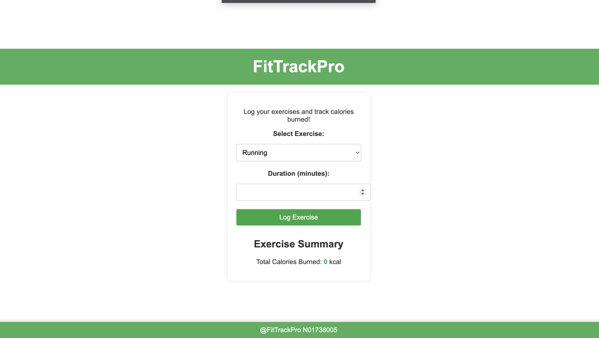

# **FitTrack Pro - Exercise Tracker Web App**

**FitTrack Pro** is a web app that allows users to log their exercise activities, track the time spent on workouts, and calculate the calories burned based on the exercise and duration. This web app developed as an implementation of classroom knowledge and skills in **JavaScript**, **HTML**, and **CSS** it aims to provide a simple, intuitive way for users to monitor their fitness journey.

## **Screenshots**
Here’s a preview of what the app looks like:

## **Features**
- **Exercise Logging**: Users can log the type of exercise and the duration.
- **Calorie Calculation**: Automatically calculates the calories burned based on the type and duration of exercise.
- **Progress Tracking**: Helps users keep track of their total exercise minutes and calories burned over time.

## **Technologies Used**
- **JavaScript**: For handling user input, performing calculations, and dynamically updating the app.
- **HTML**: For structuring the web pages and defining the layout.
- **CSS**: For styling the web pages and ensuring a responsive, user-friendly design.

## **How It Works**
1. **Exercise Logging**: The user selects the type of exercise (e.g., running, cycling) and inputs the time spent on the activity.
2. **Calories Calculation**: Based on the exercise type and duration, the app uses predefined formulas to estimate the calories burned.
3. **Tracking Progress**: The app keeps a running total of the user's logged exercises and calories burned.

## **Installation**

To get started with **FitTrack Pro**, clone this repository to your local machine:

